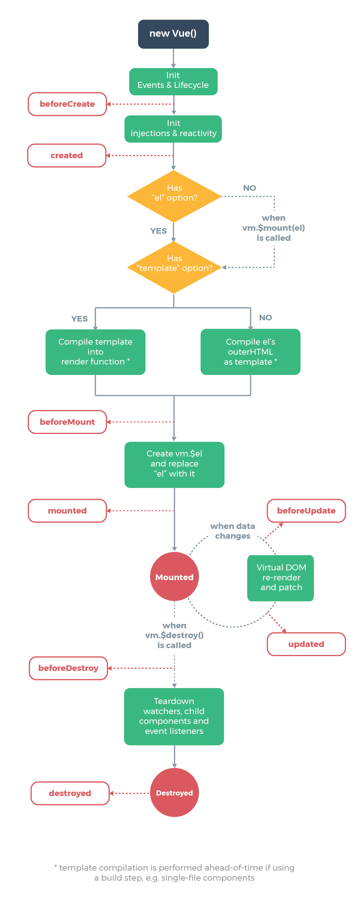

# Netmaking Vue starter

## What is Vue.js?

Vue.js is a progressive framework for building user interfaces and single-page applications

Watch intro video https://vuejs.org/v2/guide/#

```javascript
var app = new Vue({
  el: '#netmaking',
  data: {
    message: 'Welcome to the course!'
  }
})
```

## What is a SPA(Single page application)
- Documentation: https://vue-hn.herokuapp.com/top

 SPA is a web application or web site that interacts with the user by dynamically rewriting the current page rather than loading entire new pages from a server.

  - Make the application behave more like a desktop application
  
## When do I used it?

Usually when there is a need to implement an interactive interface with the user or javascript is heavy used to update the DOM

## What is Babel? 

- Documentation: https://babeljs.io/docs/en/

Babel is a JavaScript compiler.

Babel is a toolchain that is mainly used to convert ECMAScript 2015+ code into a backwards compatible version of JavaScript in current and older browsers or environments. Here are the main things Babel can do for you:

- Transform syntax
- Polyfill features that are missing in your target environment (through @babel/polyfill)
- Source code transformations (codemods)

## ES2015(ES6)

ECMAScript a scripting-language specification standardized by Ecma International in ECMA-262 and ISO/IEC 16262. It was created to standardize JavaScript, so as to foster multiple independent implementations.
ES2015 is the updated version of JavaScript (also known as ECMAScript). The more lax term for ES2015 is ES6.

```javascript
// module "my-module.js"

export default function cube(x) {
  return x * x * x;
}
```

```javascript
import cube from './my-module.js';
console.log(cube(3)); // 27
```

> Arrow functions

```javascript
// Regular JavaScript function
function(parameters) {
  statements
}

// Arrow function
(parameters) => {
  statements
}
```

### Declaring Js variables

````javascript
var x         = 5;             // Number
var name      = "Chris";       // String
var developer = true | false;  // Boolean
var location  = null;          // Null
var blue;                      // undefined
````

### Naming variables

````javascript
// VALID
var man;     
var woman3;  
var blackDog; // This is the best way to name variables with several words

// INVALID
var 1girl;   
var -girl;   
````

### Channing variables separated by comma

````javascript
var x, y, z; 
````

### Let

Introduced in ES2015 (aka ES6), the variable type let shares a lot of similarities with var but unlike var has scope constraints. let is constrained to whichever scope it is declared in. Its declaration and assignment are similar to var. let was introduced to mitigate issues posed by variables scope which developers face during development.

````javascript
let x;
let x = 5;

let x, y, z;
let x = 50, y = 20, z = 3;
````

````javascript
let x = 20;
let x = 50;

console.log(x); // SyntaxError: identifier "x" has already been declared.
````

### Const

````javascript
const x = 20; 
const y = 'boy';
const z = 'developer';

//Const must be initialized
const x; // SyntaxError: missing initializer
````

## Vue sintax

> Template

```html
{{ message }}

<span>Message: {{ msg }}</span>

<p>Using mustaches: {{ rawHtml }}</p>
<p>Using v-html directive: <span v-html="rawHtml"></span></p>
```

> Javascript expressions

```html
{{ number + 1 }}

{{ ok ? 'YES' : 'NO' }}

{{ message.split('').reverse().join('') }}

<div v-bind:id="'list-' + id"></div>
```

## Component
#### data properties
````javascript
data: {
    newTodoText: '',
    todos: [
      {
        id: 1,
        title: 'Do the dishes',
      },
      {
        id: 2,
        title: 'Take out the trash',
      },
      {
        id: 3,
        title: 'Mow the lawn'
      }
    ],
    nextTodoId: 4
  },
````
### vue life cicle methods



#### beforeMount
#### mount
#### beforeCreated
#### created
#### destroyed
### Props

Props are custom attributes you can register on a component. When a value is passed to a prop attribute, it becomes a property on that component instance.

```html
<blog-post title="My journey with Vue"></blog-post>
<blog-post title="Blogging with Vue"></blog-post>
<blog-post title="Why Vue is so fun"></blog-post>
```

### Directives

Essentially, a directive is some special token in the markup that tells the library to do something to a DOM element. In Vue.js, the concept of directive is drastically simpler than that in Angular. A Vue.js directive can only appear in the form of a prefixed HTML attribute that takes the following format:

#### v-if/v-else

````html
<h1 v-if="awesome">Vue is awesome!</h1>
<h1 v-else>Oh no 😢</h1>
````

#### v-for

````html
<li v-for="todo in todos">
  {{ todo }}
</li>
````


#### v-for & v-if

````html
<li v-for="todo in todos" v-if="!todo.isComplete">
  {{ todo }}
</li>
````

````html
<ul v-if="todos.length">
  <li v-for="todo in todos">
    {{ todo }}
  </li>
</ul>
<p v-else>No todos left!</p>
````

### Empty directives

````html
<div v-pre>
  <!-- markup in here will not be compiled -->
</div>
````

### Methods

````javascript
methods: {
    addNewTodo: function () {
      this.todos.push({
        id: this.nextTodoId++,
        title: this.newTodoText
      })
      this.newTodoText = ''
    }
  }
````

## Vue dev tools

https://chrome.google.com/webstore/detail/vuejs-devtools/ljjemllljcmogpfapbkkighbhhppjdbg?hl=en


# Installing Vue cli

```sh
npm install -g @vue/cli
# OR
yarn global add @vue/cli
```

> Creating the project with Vue cli 

```sh
vue create hello-world
```

> Start Vue cli ui

```sh
vue ui
```

> Run project

````shell
yarn serve
````

> Create a demo project

> index.html

```html
<!DOCTYPE html>
<html lang="en">
  <head>
    <meta charset="utf-8">
    <meta http-equiv="X-UA-Compatible" content="IE=edge">
    <meta name="viewport" content="width=device-width,initial-scale=1.0">
    <link rel="icon" href="<%= BASE_URL %>favicon.ico">
    <title>netmaking-demo</title>
  </head>
  <body>
    <noscript>
      <strong>We're sorry but netmaking-demo doesn't work properly without JavaScript enabled. Please enable it to continue.</strong>
    </noscript>
    <div id="app"></div>
    <!-- built files will be auto injected -->
  </body>
</html>
```

> main.js

```javascript
import Vue from 'vue'
import App from './App.vue'

//Turn off warning 
Vue.config.productionTip = false

new Vue({
  render: h => h(App),
}).$mount('#app')
```

> App.vue

```html
<template>
  <div id="app">
    
    <HelloWorld msg="Welcome to Your Vue.js App"/>
  </div>
</template>

<script>
import HelloWorld from './components/HelloWorld.vue'

export default {
  name: 'app',
  components: {
    HelloWorld
  }
}
</script>

<style>
#app {
  font-family: 'Avenir', Helvetica, Arial, sans-serif;
  -webkit-font-smoothing: antialiased;
  -moz-osx-font-smoothing: grayscale;
  text-align: center;
  color: #2c3e50;
  margin-top: 60px;
}
</style>
```

> HelloWorld.vue

```html
<template>
  <div class="hello">
    <h1>{{ msg }}</h1>
    <p>
      For a guide and recipes on how to configure / customize this project,<br>
      check out the
      <a href="https://cli.vuejs.org" target="_blank" rel="noopener">vue-cli documentation</a>.
    </p>
    <h3>Installed CLI Plugins</h3>
    <ul>
      <li><a href="https://github.com/vuejs/vue-cli/tree/dev/packages/%40vue/cli-plugin-babel" target="_blank" rel="noopener">babel</a></li>
      <li><a href="https://github.com/vuejs/vue-cli/tree/dev/packages/%40vue/cli-plugin-eslint" target="_blank" rel="noopener">eslint</a></li>
    </ul>
    <h3>Essential Links</h3>
    <ul>
      <li><a href="https://vuejs.org" target="_blank" rel="noopener">Core Docs</a></li>
      <li><a href="https://forum.vuejs.org" target="_blank" rel="noopener">Forum</a></li>
      <li><a href="https://chat.vuejs.org" target="_blank" rel="noopener">Community Chat</a></li>
      <li><a href="https://twitter.com/vuejs" target="_blank" rel="noopener">Twitter</a></li>
      <li><a href="https://news.vuejs.org" target="_blank" rel="noopener">News</a></li>
    </ul>
    <h3>Ecosystem</h3>
    <ul>
      <li><a href="https://router.vuejs.org" target="_blank" rel="noopener">vue-router</a></li>
      <li><a href="https://vuex.vuejs.org" target="_blank" rel="noopener">vuex</a></li>
      <li><a href="https://github.com/vuejs/vue-devtools#vue-devtools" target="_blank" rel="noopener">vue-devtools</a></li>
      <li><a href="https://vue-loader.vuejs.org" target="_blank" rel="noopener">vue-loader</a></li>
      <li><a href="https://github.com/vuejs/awesome-vue" target="_blank" rel="noopener">awesome-vue</a></li>
    </ul>
  </div>
</template>

<script>
export default {
  name: 'HelloWorld',
  props: {
    msg: String
  }
}
</script>

<!-- Add "scoped" attribute to limit CSS to this component only -->
<style scoped>
h3 {
  margin: 40px 0 0;
}
ul {
  list-style-type: none;
  padding: 0;
}
li {
  display: inline-block;
  margin: 0 10px;
}
a {
  color: #42b983;
}
</style>

```

#Websockets


# SPA boilerplate for Vue + Symfony + Webpack encore

```sh
git clone https://github.com/thecodingmachine/symfony-vuejs.git
```


# Electron for desktop apps with Vue
- Documentation: https://electronjs.org/docs
- Apps: https://electronjs.org/apps

```sh
yarn global add @vue/cli-init
vue init simulatedgreg/electron-vue my-project

# Install dependencies and run your app
cd my-project
yarn # or npm install
yarn run dev # or npm run dev
```

# NativeScript for mobile apps with Vue

- Setup Documentation: https://docs.nativescript.org/angular/start/quick-setup
- Vue Documentation: https://docs.nativescript.org/vuejs/nativescript-vuejs

# Inspiration, resources & much more
- https://github.com/vuejs/awesome-vue#examples
- http://pusher-community.github.io/realtime-twitter-search-vuejs/